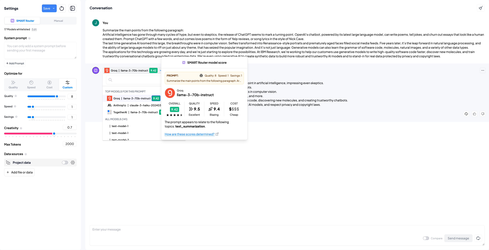

# KNN Router

A minimal server for generating a ranked list of targets, for a query, based on its k-nearest semantic neighbors. Written in Go.

KNN-router can be used within a larger system to route natural language queries to the right system, with minimal latency. Given a user query, KNN-router:

1. Looks up the most semantically similar neighbors from a curated corpus of example utterances
2. Computes a weighted average score (based on the distances between query and top-K example utterances) for each target associated with the respective utterances. Targets can be information retrieval systems, agents, LORA adapters, Small/Large Language Models, or others. The sky is the limit!
3. Returns a ranked list of targets that are most suitable for satisfying the query

At [Pulze.ai](https://platform.pulze.ai), KNN-router dynamically selects the best LLM for user requests:


Works with:

- Embeddings: [HuggingFace Text Embeddings Inference](https://github.com/huggingface/text-embeddings-inference)
- Vector Store: [Qdrant](https://github.com/qdrant/qdrant)
- Database: [Bolt](https://github.com/etcd-io/bbolt)

## Usage

### Quickstart

See this [example](./deploy/docker-compose) for getting started locally.

### Generating deployment artifacts

Dependencies:

- [`points.jsonl`](./deploy/docker-compose/data/points.jsonl): JSONL-formatted file containing points and their respective categories and embeddings. Each line should contain the following fields: `point_uid`, `category`, and `embedding`.
- [`targets.jsonl`](./deploy/docker-compose/data/targets.jsonl): JSONL-formatted file containing the targets and their respective scores for each point. Each line should contain the following fields: `point_uid`, `target`, and `score`.

The following artifacts are required for deployment:

- `embeddings.snapshot`: Snapshot of Qdrant collection containing the point embeddings
- `scores.db`: Bolt DB containing the targets and their respective scores for each point

Use this [script](./scripts/gen-artifacts.sh) to generate these artifacts:

```bash
scripts/gen-artifacts.sh --points-data-path points.jsonl --scores-data-path targets.jsonl --output-dir ./dist
```

## TODOs

- [ ] Helm chart
- [ ] GRPC endpoint
